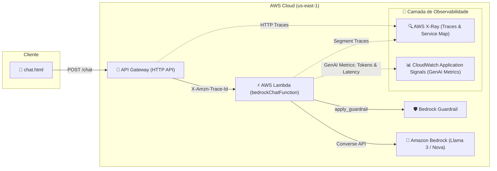

# LAB 05: Observabilidade e Monitoramento de IA Generativa com AWS X-Ray & CloudWatch Application Signals

---

## 🎯 Objetivos de Aprendizagem

Ao final deste laboratório, você será capaz de:
1. Compreender os fundamentos de **GenAI Observability** (Observabilidade para IA Generativa).
2. Habilitar e configurar o **AWS X-Ray** e o **Amazon CloudWatch Application Signals** via AWS CLI e Console.
3. Rastrear o ciclo de vida completo de inferências de LLM: tempo de resposta, consumo de tokens de entrada/saída e latência.
4. Identificar intervenções de segurança do **Bedrock Guardrail** diretamente no mapa de rastreamento (*Trace Map*).
5. Analisar o **Service Map** do CloudWatch para isolar gargalos de desempenho e dependências lentas.

---

## 🏗️ Arquitetura de Observabilidade



---

## 💻 Parte 1: Configuração via AWS CLI

Executamos a configuração de permissões e ativação do rastreamento ativo com os comandos abaixo:

### 1.1 Anexar Políticas IAM à Role da Função Lambda

```powershell
# Identificar a Role da Lambda
$ROLE_NAME = "bedrockChatFunction-role-wvirpv3q"

# Anexar permissão de escrita no daemon do X-Ray
aws iam attach-role-policy `
    --role-name $ROLE_NAME `
    --policy-arn arn:aws:iam::aws:policy/AWSXRayDaemonWriteAccess

# Anexar política gerenciada do CloudWatch Application Signals
aws iam attach-role-policy `
    --role-name $ROLE_NAME `
    --policy-arn arn:aws:iam::aws:policy/CloudWatchLambdaApplicationSignalsExecutionRolePolicy
```

### 1.2 Habilitar o Rastreamento Ativo (Active Tracing) no Lambda

```powershell
aws lambda update-function-configuration `
    --function-name bedrockChatFunction `
    --tracing-config Mode=Active
```

### 1.3 Ajustar Limites de Taxa e Throttling no API Gateway

```powershell
aws apigatewayv2 update-stage `
    --api-id s2xumiyt68 `
    --stage-name "default" `
    --default-route-settings "ThrottlingBurstLimit=100,ThrottlingRateLimit=100.0"
```

---

## 🖥️ Parte 2: Ativação do Application Signals no Console da AWS

1. Acesse o console da **AWS** na região **us-east-1 (N. Virginia)**.
2. Navegue até **AWS Lambda > Functions > `bedrockChatFunction`**.
3. Clique na aba **Configuration** (Configuração) e selecione **Monitoring and operations tools** (Ferramentas de monitoramento e operações).
4. Clique em **Edit** (Editar):
   * Em **AWS X-Ray**, confirme que **Active tracing** está selecionado (**PassThrough** ➔ **Active**).
   * Em **Amazon CloudWatch Application Signals**, marque a caixa **Enable Application Signals**.
5. Clique em **Save** (Salvar).

> [!NOTE]
> Ao ativar o Application Signals pelo console, o Lambda anexa automaticamente a camada (Layer) do **AWS Distro for OpenTelemetry (ADOT)**, configurando a instrumentação automática do SDK Boto3 para chamadas ao Amazon Bedrock.

---

## 🧪 Parte 3: Roteiro Prático de Exploração e Análise

### Exercício 1: Gerando Carga e Traces de Inferência

1. Abra o frontend [`chat.html`](file:///c:/apps/bedrockChat/chat.html) no navegador.
2. Envie 4 requisições consecutivas alternando entre diferentes modelos:
   * **Meta Llama 3 8B Instruct**
   * **Meta Llama 3.1 8B Instruct**
   * **Amazon Nova Lite v1**
   * **Amazon Nova Micro v1**
3. Envie uma requisição com o **Bedrock Guardrail Ativado** utilizando o preset `[LLM07] System Prompt Leakage`.

---

### Exercício 2: Investigando o Service Map (Mapa de Serviços)

1. No console da AWS, acesse o serviço **Amazon CloudWatch**.
2. No menu de navegação lateral esquerdo, vá em **Application Signals > Service map** (ou **X-Ray traces > Service map**).
3. Observe o diagrama de nós gerado em tempo real:
   * **Nó 1 (Client / API Gateway):** Ponto de entrada das requisições HTTP.
   * **Nó 2 (`bedrockChatFunction`):** Tempo de execução do runtime Python.
   * **Nó 3 (`bedrock-runtime.us-east-1.amazonaws.com`):** Tempo de resposta e latência de inferência da LLM.

```
[ Cliente Web ] ────(200 OK)────> [ Lambda: bedrockChatFunction ] ────(Converse API)────> [ Amazon Bedrock ]
                                          │
                                    (apply_guardrail)
                                          ▼
                               [ Bedrock Guardrail ]
```

---

### Exercício 3: Análise Detalhada de Traces no AWS X-Ray

1. No menu lateral do **CloudWatch**, clique em **X-Ray traces > Traces**.
2. Filtre os rastreamentos pelos últimos 15 minutos e selecione o trace mais recente.
3. Na visualização de **Trace Details (Linha do Tempo)**, analise a divisão de tempo:
   * **Initialization / Cold Start:** Tempo de inicialização do contêiner Lambda.
   * **Invocation:** Tempo total de execução do handler.
   * **Bedrock Converse Subsegment:** Tempo gasto exclusivamente na geração de texto pelo modelo de fundação.

---

### Exercício 4: Métricas de GenAI no Application Signals

1. No menu lateral do **CloudWatch**, acesse **Application Signals > Services**.
2. Selecione o serviço **`bedrockChatFunction`**.
3. Na aba **Service details**, explore as métricas coletadas:
   * **Latency (Latência p50, p90, p99):** Comparativo de velocidade de inferência.
   * **Fault Rate & Error Rate:** Taxa de erros HTTP 4xx ou 5xx.
   * **Token Consumption:** Quantidade de tokens de entrada (*input tokens*) versus saída (*output tokens*) consumidos pela turma durante a aula.

---

## 🔒 Perguntas para Discussão em Aula

1. **Impacto de Segurança:** Como o X-Ray e o CloudWatch ajudam a detectar ataques de *Denial of Wallet* (esgotamento de cota de tokens por requisições abusivas)?
2. **Latência de Segurança:** Qual foi o acréscimo de latência (overhead em ms) causado pela inspeção do Bedrock Guardrail em comparação com a chamada sem proteção?
3. **Governança:** Como os metadados de OpenTelemetry (`gen_ai.request.model`, `gen_ai.usage.total_tokens`) auxiliam times de FinOps e Segurança no monitoramento contínuo de IA?
