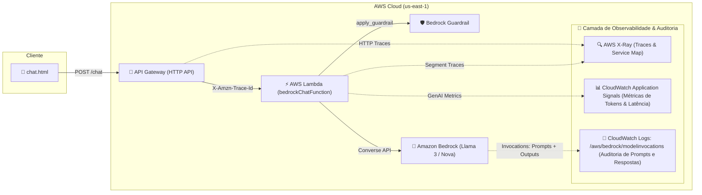

# LAB 05: Observabilidade e Monitoramento de IA Generativa com AWS X-Ray, CloudWatch Application Signals & Model Invocation Logging

---

## 🎯 Objetivos de Aprendizagem

Ao final deste laboratório, você será capaz de:
1. Compreender a tríade da **GenAI Observability** na AWS:
   * **AWS X-Ray:** Rastreamento distribuído e análise de latência de infraestrutura.
   * **CloudWatch Application Signals:** Métricas de desempenho de IA (Tokens, Model IDs, Error Rates).
   * **Bedrock Model Invocation Logging:** Auditoria completa do conteúdo dos prompts de entrada e respostas geradas.
2. Habilitar e configurar o ecossistema completo via AWS CLI e Console.
3. Rastrear o ciclo de vida completo de inferências de LLM: tempo de resposta, consumo de tokens e latência.
4. Auditar tentativas de ataque (Prompt Injection, Jailbreaks) e vazamento de dados diretamente no CloudWatch Logs Insights.
5. Analisar o **Service Map** do CloudWatch para isolar gargalos de desempenho e dependências lentas.

---

## 🏗️ Arquitetura Completa de Observabilidade



---

## 💻 Parte 1: Configuração via AWS CLI

A configuração completa dos 3 pilares de observabilidade pode ser realizada pelos comandos abaixo:

### 1.1 Anexar Políticas IAM à Role da Função Lambda

```powershell
$ROLE_NAME = "bedrockChatFunction-role-wvirpv3q"

# Anexar permissão para envio de traces ao X-Ray
aws iam attach-role-policy `
    --role-name $ROLE_NAME `
    --policy-arn arn:aws:iam::aws:policy/AWSXRayDaemonWriteAccess

# Anexar política gerenciada do CloudWatch Application Signals
aws iam attach-role-policy `
    --role-name $ROLE_NAME `
    --policy-arn arn:aws:iam::aws:policy/CloudWatchLambdaApplicationSignalsExecutionRolePolicy
```

### 1.2 Habilitar o Rastreamento Ativo (Active Tracing) no Lambda

```powershell
aws lambda update-function-configuration `
    --function-name bedrockChatFunction `
    --tracing-config Mode=Active
```

### 1.3 Configurar o Bedrock Model Invocation Logging (Auditoria de Prompts e Respostas)

```powershell
# 1. Criar o Log Group de auditoria do Bedrock
aws logs create-log-group --log-group-name "/aws/bedrock/modelinvocations" --region us-east-1

# 2. Criar a Role de Logging para o Bedrock assumir
$trustPolicy = '{"Version":"2012-10-17","Statement":[{"Effect":"Allow","Principal":{"Service":"bedrock.amazonaws.com"},"Action":"sts:AssumeRole"}]}'
$trustPolicy | Out-File -FilePath "trust_policy.json" -Encoding ascii
aws iam create-role --role-name BedrockModelInvocationLoggingRole --assume-role-policy-document file://trust_policy.json

# 3. Anexar permissões de escrita de log para a Role
$permPolicy = '{"Version":"2012-10-17","Statement":[{"Effect":"Allow","Action":["logs:CreateLogStream","logs:PutLogEvents"],"Resource":"arn:aws:logs:us-east-1:*:log-group:/aws/bedrock/modelinvocations:*"}]}'
$permPolicy | Out-File -FilePath "perm_policy.json" -Encoding ascii
aws iam put-role-policy --role-name BedrockModelInvocationLoggingRole --policy-name BedrockLoggingPolicy --policy-document file://perm_policy.json

# 4. Habilitar o Model Invocation Logging no Amazon Bedrock
$logConfig = '{"cloudWatchConfig":{"logGroupName":"/aws/bedrock/modelinvocations","roleArn":"arn:aws:iam::947675433597:role/BedrockModelInvocationLoggingRole"},"textDataDeliveryEnabled":true,"imageDataDeliveryEnabled":true,"embeddingDataDeliveryEnabled":true}'
aws bedrock put-model-invocation-logging-configuration --region us-east-1 --logging-config $logConfig
```

---

## 🖥️ Parte 2: Ativação do Application Signals no Console da AWS

1. Acesse o console da **AWS** na região **us-east-1 (N. Virginia)**.
2. Navegue até **AWS Lambda > Functions > `bedrockChatFunction`**.
3. Clique na aba **Configuration** (Configuração) e selecione **Monitoring and operations tools** (Ferramentas de monitoramento e operações).
4. Clique em **Edit** (Editar):
   * Em **AWS X-Ray**, confirme que **Active tracing** está selecionado (**Active**).
   * Em **Amazon CloudWatch Application Signals**, marque a caixa **Enable Application Signals**.
5. Clique em **Save** (Salvar).

---

## 🧪 Parte 3: Roteiro Prático de Exploração e Análise

### Exercício 1: Gerando Carga e Traces de Inferência

1. Abra o frontend [`chat.html`](file:///c:/apps/bedrockChat/chat.html) no navegador.
2. Envie 4 requisições consecutivas alternando entre diferentes modelos:
   * **Meta Llama 3 8B Instruct**
   * **Meta Llama 3.1 8B Instruct**
   * **Amazon Nova Lite v1**
   * **Amazon Nova Micro v1**
3. Envie uma requisição com o **Bedrock Guardrail Ativado** utilizando o preset `[LLM07] System Prompt Leakage`.

---

### Exercício 2: Investigando o Service Map (Mapa de Serviços)

1. No console da AWS, acesse o serviço **Amazon CloudWatch**.
2. No menu de navegação lateral esquerdo, vá em **Application Signals > Service map** (ou **X-Ray traces > Service map**).
3. Observe o diagrama de nós gerado em tempo real:
   * **Nó 1 (Client / API Gateway):** Ponto de entrada das requisições HTTP.
   * **Nó 2 (`bedrockChatFunction`):** Tempo de execução do runtime Python.
   * **Nó 3 (`bedrock-runtime.us-east-1.amazonaws.com`):** Tempo de resposta e latência de inferência da LLM.

```
[ Cliente Web ] ────(200 OK)────> [ Lambda: bedrockChatFunction ] ────(Converse API)────> [ Amazon Bedrock ]
                                          │
                                    (apply_guardrail)
                                          ▼
                               [ Bedrock Guardrail ]
```

---

### Exercício 3: Análise Detalhada de Traces no AWS X-Ray

1. No menu lateral do **CloudWatch**, clique em **X-Ray traces > Traces**.
2. Filtre os rastreamentos pelos últimos 15 minutos e selecione o trace mais recente.
3. Na visualização de **Trace Details (Linha do Tempo)**, analise a divisão de tempo:
   * **Initialization / Cold Start:** Tempo de inicialização do contêiner Lambda.
   * **Invocation:** Tempo total de execução do handler.
   * **Bedrock Converse Subsegment:** Tempo gasto exclusivamente na geração de texto pelo modelo de fundação.

---

### Exercício 4: Métricas de GenAI no Application Signals

1. No menu lateral do **CloudWatch**, acesse **Application Signals > Services**.
2. Selecione o serviço **`bedrockChatFunction`**.
3. Na aba **Service details**, explore as métricas coletadas:
   * **Latency (Latência p50, p90, p99):** Comparativo de velocidade de inferência.
   * **Fault Rate & Error Rate:** Taxa de erros HTTP 4xx ou 5xx.
   * **Token Consumption:** Quantidade de tokens de entrada (*input tokens*) versus saída (*output tokens*) consumidos pela turma durante a aula.

---

### Exercício 5: Auditoria de Prompts e Respostas com CloudWatch Logs Insights

Com o **Model Invocation Logging** ativo, você pode consultar o texto completo de todas as conversas e prompts enviados para a IA:

1. No console da AWS, acesse **CloudWatch > Logs > Logs Insights**.
2. Selecione o Log Group: **`/aws/bedrock/modelinvocations`**.
3. Execute a seguinte consulta SQL/CloudWatch para extrair o Modelo, Prompt do Usuário, Tokens e Resposta:

```sql
fields @timestamp, modelId, input.inputBodyJson.messages.0.content.0.text as Prompt, output.outputBodyJson.output.message.content.0.text as Resposta, usage.totalTokens as TotalTokens, metrics.latencyMs as LatenciaMs
| sort @timestamp desc
| limit 20
```

4. Observe a tabela com a auditoria completa de cada mensagem trocada pelos alunos!

---

## 🔒 Perguntas para Discussão em Aula

1. **Privacidade e LGPD:** Quando é seguro habilitar o *Model Invocation Logging* em produção? Como o *Bedrock Guardrails (mascaramento de PII)* protege os dados antes da gravação do log?
2. **Impacto de Segurança:** Como o X-Ray e o CloudWatch ajudam a detectar ataques de *Denial of Wallet* (esgotamento de cota de tokens por requisições abusivas)?
3. **Comparação de Ferramental:** Em quais cenários corporativos deve-se usar a pilha nativa da AWS (**X-Ray + Application Signals + Invocations**) versus ferramentas de terceiros como **Langfuse** ou **LangSmith**?
